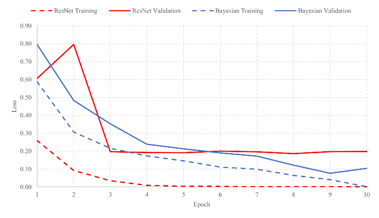

# BCNN_XRAY
Implementation of Bayesian Convolutional Neural Network (BCNN) using TensorFlow and TensorFlow Probability on a dataset containing chest X-rays.

# Usage
Run main.py to load model and test. Change load_saved_model = False and uncomment train_models line to train a new model.
You can load a model and continue training as well by uncommenting train_models and loading a model beforehand.
Current epoch will be pulled from hist.csv file.

# Dataset
The dataset used was is from Kaggle [here](https://www.kaggle.com/paultimothymooney/chest-xray-pneumonia) and consited of 5856 JPEG images of chest X-rays of various sizes. I did not use the training, testing, and validation sets as is. Instead I merged all of the files together, resized all images to (256,256,1), and converted them all to greyscale as some has RGB dimensions. Labels were set by the directory they came from, either Normal (0) or Pneumonia (1). This dataset was then spit back into training, test, and validation sets at 70%, 15%, and 15% distribution respectivelty. Random oversampling was used to balance the classes on the training dataset.

# Results

# References
1.	D. Kermany, K. Zhang, and M. Goldbaum, “Labeled Optical Coherence Tomography (OCT) and Chest X-Ray Images for Classification”, Mendeley Data, v2. http://dx.doi.org/10.17632/rscbjbr9sj.2
2.	D. Varshni, K. Thakral, L. Agarwal, R. Nijhawan and A. Mittal, "Pneumonia Detection Using CNN based Feature Extraction," 2019 IEEE International Conference on Electrical, Computer and Communication Technologies (ICECCT), Coimbatore, India, 2019, pp. 1-7, doi: 10.1109/ICECCT.2019.8869364.
3.	M. Abadi, et al, "TensorFlow: Large-scale machine learning on heterogeneous systems", 2015. https://www.tensorflow.org
4.	M. F. Hashmi, “Efficient Pneumonia Detection in Chest Xray Images Using Deep Transfer Learning”, 2020,  doi: 10.3390/diagnostics10060417.
5.	M. Fiszman, W. W. Chapman, D. Aronsky, R. S. Evans, and P. J. Haug, “Automatic Detection of Acute Bacterial Pneumonia from Chest X-ray Reports”  , 2000,  doi: 10.1136/jamia.2000.0070593.
6.	P. Dwivedi, “Understanding and Coding a ResNet in Keras”, 2019. https://towardsdatascience.com/understanding-and-coding-a-resnet-in-keras-446d7ff84d33
7.	Y. Wen, P. Vicol, J. Ba, D. Tran, R. Grosse, "Flipout: Efficient Pseudo-Independent Weight Pertubations on Mini-Batches", 2018, arXiv:1803.04386. 

